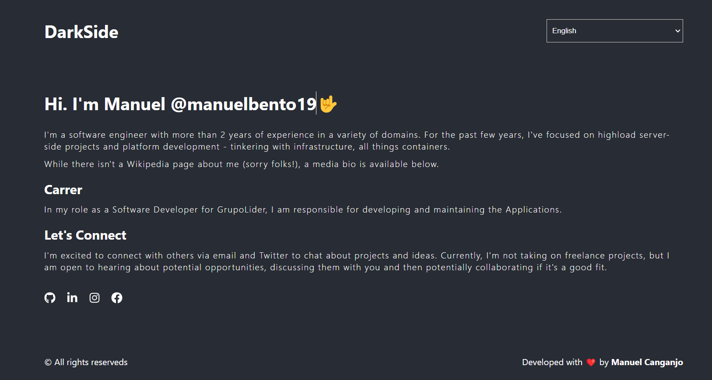

<h1 align="center">
  📸📝<br>React Multi Language App
</h1>
<p>An React integration of i18next and plus some utility components to help you translate your React websites!</p>



<h4 align="center"><a href="https://react-multi-language-app.vercel.app/">Clique para visitar o projeto</a></h4>

---

## 💼 Tecnologias utilizadas

Para o desenvolvimento deste site utilizei as seguintes tecnologias:
- React.js
- SASS
- React Icons
- i18next

## 🚀 Getting started

### 1. Install

```bash
npm install
```

or

```bash
pnpm add
```

or

```bash
yarn add
```
### 2. Run

```bash
npm run start
```

or

```bash
pnpm start
```

or

```bash
yarn start
```
---
<h2>👨‍🚀 Autor</h2>

<table>
  <tr>
    <td>
      <a href="https://github.com/manuelbento19">
        <br>
        <sub>
          <b>Manuel Bento</b>
        </sub>
      </a>
    </td>
  </tr>
</table>
